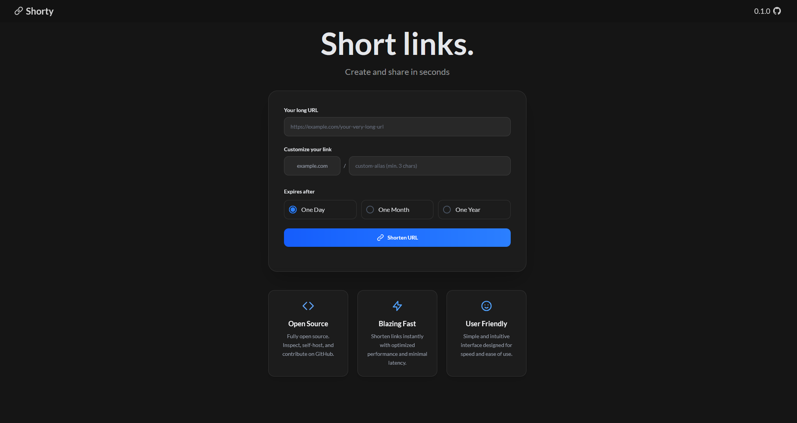

# Shorty - URL Shortener App

A comprehensive self-hosted web application designed for simple and fast URL shortening


[](https://app.codacy.com/gh/alxww55/shorty/dashboard?utm_source=gh&utm_medium=referral&utm_content=&utm_campaign=Badge_grade)



## Key Features
- **Dynamic Prefix** - automatically prepends your hostname to shortened URLs
- **Custom Aliases** - Create custom aliases for all shortened links
- **Redirecting** - Fast redirecting to original URL
- **Expiration and CleanUp** - Automatic deletion of expired shortened URLs
- **Validation** - Ensures data integrity and accuracy, increases security
- **404 Page** - Custom page for 404 Not Found to stay user-friendly

## Technology Stack
### Backend
- **Python 3.14** with FastAPI and async/await
- **SQLAlchemy 2.0** with Alembic migrations
- **RabbitMQ** with Taskiq
### Frontend
- **HTMX** templates with Jinja2
- **Tailwind CSS** for styling
### Infrastructure
- **Multi-stage Docker Build** - App + Worker + Scheduler
- **Docker Compose** with health checks

## Getting Started
### 1. Clone the repository
```bash
git clone https://github.com/alxww55/shorty.git && cd shorty
```
### 2. Prepare .env file
```bash
cp .env.example .env
```
### 3. Set environment variables
```env
# ============================================================================
# APPLICATION CORE SETTINGS
# ============================================================================
APP_NAME = "string"              # Application display name
DESCRIPTION = "string"           # Description shown under /docs endpoint
VERSION = "string"               # Application version
STATIC_DIR = "string"            # Directory for static files
DEBUG = False                    # Enable debug (not recommended for production)
HOST = "0.0.0.0"                 # Application host
PORT = 8000                      # Application TCP port
CORS_ORIGINS = ["string", "..."] # Allowed CORS origins

# ============================================================================
# DATABASE CONFIGURATION (PostgreSQL)
# ============================================================================
DB_CONFIG__DB_USER = "username"
DB_CONFIG__DB_PASSWORD = "password"
DB_CONFIG__DB_HOST = "hostname"
DB_CONFIG__DB_PORT = 5432
DB_CONFIG__DB_NAME = "db_name"

# ============================================================================
# MESSAGE QUEUE CONFIGURATION (RabbitMQ)
# ============================================================================
RABBITMQ_CONFIG__RABBITMQ_USER = "username"
RABBITMQ_CONFIG__RABBITMQ_PASSWORD = "password"
RABBITMQ_CONFIG__RABBITMQ_HOST = "hostname"
RABBITMQ_CONFIG__RABBITMQ_PORT = 5672

# ============================================================================
# LOGGING CONFIGURATION
# ============================================================================
LOGGING_CONFIG__LOG_FILE_PATH = "./logs/logs.log"
LOGGING_CONFIG__ROTATION = "1 day"                  # Log file rotation interval
LOGGING_CONFIG__RETENTION = "1 day"                 # Log file retention interval
LOGGING_CONFIG__FORMAT = "{time:YYYY-MM-DD at HH:mm:ss} | {level} | {message}"

# ============================================================================
# NOTE: Core settings have sensible defaults. Only modify values you need to change.
# ============================================================================
```
### 4. Run with Docker Compose
```bash
docker compose up --build
```
## Project Status
This project is currently under active development. Features are being added and existing ones refined regularly. Contributions are welcome!

Feel free to:
- Open issues for bugs or suggestions
- Submit pull requests with improvements
- Contact me directly to discuss collaboration

Contributors will be recognized in project credits.

## Author
Created by [alxww55](https://github.com/alxww55)